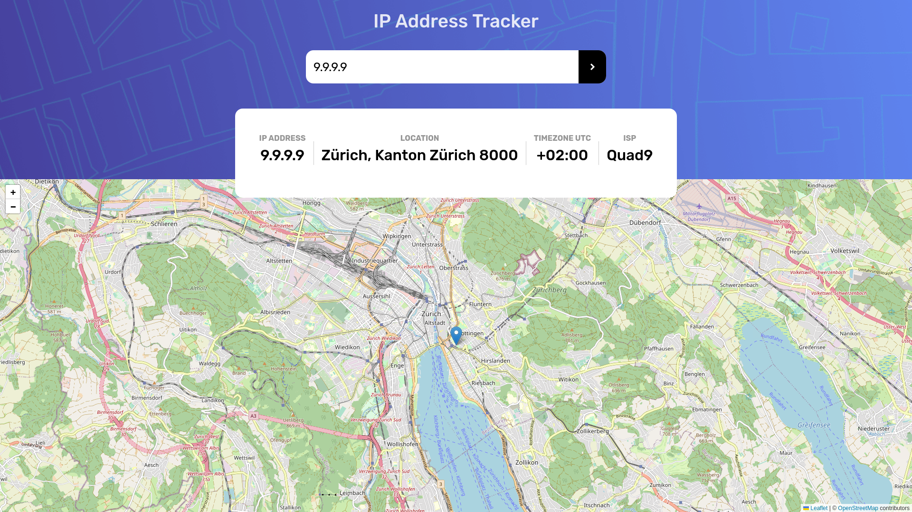

# Frontend Mentor - IP address tracker solution

This is a solution to the [IP address tracker challenge on Frontend Mentor](https://www.frontendmentor.io/challenges/ip-address-tracker-I8-0yYAH0). Frontend Mentor challenges help you improve your coding skills by building realistic projects.

## Table of contents

- [Overview](#overview)
  - [The challenge](#the-challenge)
  - [Screenshot](#screenshot)
  - [Links](#links)
- [My process](#my-process)
  - [Built with](#built-with)
  - [Useful resources](#useful-resources)
- [Author](#author)

## Overview

### The challenge

Users should be able to:

- View the optimal layout for each page depending on their device's screen size
- See hover states for all interactive elements on the page
- See their own IP address on the map on the initial page load
- Search for any IP addresses or domains and see the key information and location

### Screenshot

### Links

- Solution URL: [Add solution URL here](https://your-solution-url.com)
- Live Site URL: [Add live site URL here](https://your-live-site-url.com)

## My process

### Built with

- Semantic HTML5 markup
- Mobile-first workflow
- [React](https://reactjs.org/) - JS library
- [Styled Components](https://styled-components.com/) - For styles

### Useful resources

- [React Docs](https://reactjs.org/docs/getting-started.html) - The docs for React are solid,I mainly used them to look up the new hooks! Reading the framework/library docs is my go-to and has never failed me! Definite recommend!
- [React Context Docs](https://reactjs.org/docs/context.html) - This was my first use of the Context library. I have used Redux so I wasn't completely lost and I'm very impressed at how easy it was to implement. (See was I call the Brad Taversy "System" for more info)
- [Axios Docs](https://axios-http.com/docs/intro) - Axios is amazing! It just works! The document is clear and concise! I use Axios for my HTTP request to the API and never had an issue with it.
- [React Route V6 Docs](https://reactrouter.com/docs/en/v6/upgrading/v5) - I didn't even realize until a Switch didn't work that install version 6 of React-Router-dom. And instead of rolling back to version 5, I went with it. Thanks to their amazing Upgrade to V6 documentation, I was quickly back on track. I haven't fully used all the new possibilities (especially on Routes) but hope to do so in some refactoring.
- [Fireship.io](https://www.youtube.com/c/Fireship) - Awesome Youtube channel. Fireship.io has a "Concept/framework in 100sec" playlist to quickly learn the very basics of a Programming language, framework, or concept. There are also longer videos for more in-depth frontend mini-projects (CSS grid, flex...)
- [Brad Taversy](https://www.youtube.com/c/TraversyMedia) - Awesome Youtube Channel and Udemy course on react and the Context library. I followed his React Crash Course and Udemy course on React. His implementation of Context is what I used and I feel very comfortable with it. It has a redux feel and I love it!
- [Kevin Powell](https://www.youtube.com/kepowob) - Discovered on FrontendMentor with the partnership on the Space challenge and where my CSS game step up to all new level (Have a look at my other challenges to see the differences)
- [Google](google.com) - Last but not least, the ultimate bug solver!

## Author

- Website - [whoamihealay](https://whoamiandrew.com/)
- Frontend Mentor - [@whoamihealay](https://www.frontendmentor.io/profile/whoamihealay)
- Linkedin - [@andrewsouthern01](https://www.linkedin.com/in/andrewsouthern01/)
